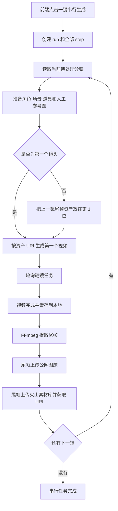

# 谜镜视频模型一键串行生成逻辑与参数说明

> 整理日期：2026-08-06
>
> 适用项目：Eggfans 短剧生产工具
>
> 文档范围：从前端点击“一键串行生成”开始，到所有分镜视频依次生成、提取尾帧、上传火山素材库并衔接下一镜为止。
>
> 注意：这里描述的是“按已有分镜串行生成视频”的链路，不是 AI 文本模型拆解剧本、生成分镜数据的链路。

## 1. 功能目标

谜镜串行模式按分镜编号逐镜生成视频，核心连续性规则如下：

1. 第一个镜头使用当前分镜涉及的角色、场景、道具和人工参考图生成。
2. 第一个镜头完成后，从本地视频末尾提取一张尾帧。
3. 尾帧先上传公网图床，再上传火山素材库，获得火山资产 ID/URI。
4. 第二个镜头把第一镜尾帧资产放在参考列表第 1 位，并明确绑定为“首帧画面”。
5. 第二个镜头完成后重复同样过程，为第三镜提供首帧。
6. 所有镜头严格串行：前一镜视频、尾帧和火山资产未完成时，后一镜不会提交。
7. 每个镜头提交给谜镜的总资产数量不得超过 9。



## 2. 当前谜镜视频配置快照

当前本机数据库中启用的谜镜视频配置如下。API Key 不在本文档中展示。

| 参数 | 当前值 | 来源 |
| --- | --- | --- |
| 配置 ID | `64` | `ai_service_configs.id` |
| 配置名称 | `谜镜视频-视频` | 数据库配置 |
| Provider | `mijing` | 数据库配置 |
| 当前模型 | `山河2.0-mini` | 数据库配置的第一个模型 |
| Base URL | `https://api.magine.work` | 数据库配置 |
| 创建端点 | `/v1/video/generations` | 数据库配置 |
| 查询端点 | `/v1/video/generations/{task_id}` | 数据库配置 |
| 请求方式 | `POST` | 谜镜模型元数据 |
| 查询方式 | `GET` | 谜镜模型元数据 |
| 默认比例 | `16:9` | 串行调用未传比例时的本地默认值 |
| 默认分辨率 | `720p` | `settings.mijing.defaults.resolution` |
| 水印 | `false` | 谜镜适配器固定值 |
| 生成声音 | `true` | 谜镜适配器固定值 |
| 模型元数据时长 | 最小 `4` 秒，最大 `15` 秒，默认 `5` 秒 | 当前模型 `extraJson` |

谜镜模型列表通过下面的接口发现：

```http
GET https://api.mjing.cc/v1/aimodels
Authorization: Bearer <MIJING_API_KEY>
```

视频模型统一登记的端点为：

```text
POST /v1/video/generations
GET  /v1/video/generations/{task_id}
```

如果旧配置仍填写 `https://api.mjing.cc` 或 `https://api.mjing.cc/v1`，视频适配器会自动迁移到当前创作网关 `https://api.magine.work`，但不会替换用户选择的模型名。

## 3. 前端入口与接口

只有当前选中的视频配置满足 `provider === "mijing"` 时，视频生成板块才显示“一键串行生成”。

### 3.1 启动请求

```http
POST /api/v1/videos/sequential
Content-Type: application/json

{
  "drama_id": 6,
  "episode_id": 88,
  "config_id": 64,
  "model": "山河2.0-mini"
}
```

字段优先级：

| 字段 | 规则 |
| --- | --- |
| `drama_id` | 必填，必须与当前集所属短剧一致 |
| `episode_id` | 必填，必须是有效集 ID |
| `config_id` | 优先使用前端当前选择；未传时回退到 `episode.video_config_id` |
| `model` | 优先使用前端当前选择；未传时使用该配置的第一个模型 |

启动前的硬性检查：

- 配置必须存在且启用。
- 配置 Provider 必须为 `mijing`。
- 模型名不能为空。
- 当前集必须已有至少一个未删除分镜。
- 同一集若已有 `queued`、`running` 或 `paused` 的串行任务，不创建重复任务，只恢复并返回原任务。

### 3.2 状态与控制接口

| 接口 | 用途 |
| --- | --- |
| `GET /api/v1/videos/sequential/episode/:episodeId` | 获取该集最新一次串行任务 |
| `GET /api/v1/videos/sequential/:runId` | 获取任务及所有镜头步骤 |
| `POST /api/v1/videos/sequential/:runId/retry` | 从失败镜头继续 |
| `POST /api/v1/videos/sequential/:runId/cancel` | 停止本地串行任务 |

前端每 `5` 秒刷新一次串行任务，同时读取各步骤关联的 `video_generation_id`，把已经完成的视频立即显示在对应分镜中，不需要等待全集全部完成。

## 4. 任务创建与执行顺序

启动成功后，系统创建一条 `video_sequence_runs`，并按 `storyboard_number` 升序为每个分镜创建一条 `video_sequence_steps`。

步骤处理顺序固定为：

```text
pending
  -> preparing
  -> submitting
  -> processing
  -> extracting_tail
  -> completed
```

任何一步抛出错误时：

```text
当前 step -> failed
当前 run  -> failed
后续 step 保持 pending
```

任务按数据库中的第一个未完成步骤继续处理，不并发提交多个镜头。

## 5. 每个镜头如何识别参考资产

系统用当前分镜的以下文本组成识别上下文：

```text
video_prompt + action + description
```

### 5.1 场景识别

优先使用 `storyboard.scene_id` 直接找到场景。没有 `scene_id` 时，按以下条件匹配：

- 场景属于当前集或当前短剧；
- 场景 `location` 等于分镜 `location`；或
- 场景名称出现在 `<location>场景名</location>` 标签中。

### 5.2 角色识别

角色满足任一条件即纳入：

- 已存在于 `storyboard_characters` 关联表；
- 角色名出现在 `<role>角色名</role>` 标签中。

`<voice>角色名</voice>` 不参与资产识别，避免对白说话人自动增加不应出现在画面中的角色。

### 5.3 道具识别

当前短剧中未删除的道具，只要道具名称直接出现在上述分镜文本中，就会纳入参考资产。

### 5.4 人工参考图

从 `storyboards.reference_images` 的 JSON 数组读取。人工参考图属于可选资产，排在角色、场景、道具之后。

## 6. 参考资产顺序与 9 个上限

资产顺序不是随机的，固定如下。

第一个镜头：

```text
角色 -> 场景 -> 道具 -> 人工参考图
```

第二个及后续镜头：

```text
上一镜尾帧 -> 角色 -> 场景 -> 道具 -> 人工参考图
```

数量计算公式：

```text
资产总数 = 上一镜尾帧(0或1) + 角色数 + 场景数(0或1) + 道具数 + 人工参考图数
```

规则：

- 上一镜尾帧、角色、场景、道具属于必需资产。
- 必需资产合计超过 `9` 时，当前镜头直接失败，不会静默丢弃人物、场景或道具。
- 人工参考图属于可选资产；剩余名额不足时只截断末尾人工参考图，并记录警告日志。
- 按公网 URL 和火山资产 ID 双重去重。
- 第二镜开始，上一镜尾帧必须同时具备公网 URL 和火山资产 ID，否则停止当前镜头。

典型后续镜头：

```text
1 张上一镜尾帧 + 2 个角色 + 1 个场景 + 1 个道具 + 4 张人工参考图 = 9 个资产
```

## 7. 图片上传火山素材库的链路

所有参与串行生成的角色、场景、道具、人工参考图和上一镜尾帧，最终都必须得到火山素材 ID/URI。

### 7.1 本地图片先转为公网 URL

火山资产创建接口接收图片 URL，不接收本地路径。处理规则：

1. 来源本身已经是公网 `http/https` URL 时直接使用。
2. 本地静态文件或 Data URL 先读取为文件。
3. 默认图床顺序为：山河图床 -> Uguu -> Eggfans 图床。
4. 任一图床成功即停止后续回退。
5. 上传结果保存在本地 `assets` 表，可按原始来源复用。

### 7.2 创建或复用火山素材组

普通素材默认组名：

```text
Eggfans-短剧-{dramaId}
```

角色虚拟角色库默认组名：

```text
Eggfans-短剧-{dramaId}-虚拟角色库
```

角色资产名称：

```text
角色-{角色名}-{角色类型}
```

### 7.3 创建火山资产的请求体

```http
POST <火山素材通道 base_url>/v1/assets
Authorization: Bearer <VOLC_ASSET_API_KEY>
Content-Type: application/json

{
  "group_id": "<本地素材组ID>",
  "url": "https://<公网图床>/<图片文件>",
  "name": "角色-林凡-男主",
  "asset_type": "Image",
  "project_name": "<配置的项目名>",
  "wait_for_active": true,
  "timeout_ms": 120000
}
```

本地等待火山创建接口的网络超时为 `130` 秒。对于 `408/409/425/429/5xx`、网络中断和超时错误会按内部重试表自动重试。

响应必须至少返回：

```json
{
  "provider_asset_id": "asset-xxx",
  "asset_uri": "asset://asset-xxx"
}
```

如果 `asset_uri` 缺失，串行代码会回退使用 `provider_asset_id` 组装 URI；如果 `provider_asset_id` 缺失则上传失败。

## 8. URI 在提示词和请求参数中的两种格式

这是当前链路最容易混淆的部分。

### 8.1 提示词绑定使用小写 `@asset://`

```text
连续镜头资产绑定：首帧画面=@asset://asset-tail ；林凡=@asset://asset-role ；客厅=@asset://asset-scene
```

用途：告诉模型“名称和哪个资产对应”，每个资产只声明一次。

### 8.2 `reference_image_urls` 使用 `Asset://`

```json
{
  "reference_image_urls": [
    "Asset://asset-tail",
    "Asset://asset-role",
    "Asset://asset-scene"
  ]
}
```

用途：作为谜镜 API 的实际媒体参考参数。第二镜开始，第 1 项固定是上一镜尾帧。

当前实现同时传输：

- `prompt` 中的语义绑定：`名称=@asset://资产ID`
- `reference_image_urls` 中的媒体资产：`Asset://资产ID`

两者不是重复传图，而是分别承担“语义绑定”和“媒体引用”。

## 9. 串行提示词组装规则

系统会先删除原提示词中已经存在的旧“连续镜头资产绑定”区块，避免重新生成时出现两遍资产绑定，然后重新拼接当前资产。

### 9.1 第一个镜头提示词结构

```text
连续镜头资产绑定：林凡=@asset://asset-role ；客厅=@asset://asset-scene
这是串行生成的第一个镜头；角色、场景和道具只使用对应资产的外观，不要重新设计，不要改变服装或人物关系。
资产 ID 只在本段绑定中声明一次；对白中的角色名保持原文。
<原始 video_prompt>
```

### 9.2 后续镜头提示词结构

```text
连续镜头资产绑定：首帧画面=@asset://asset-tail ；林凡=@asset://asset-role ；客厅=@asset://asset-scene
首帧画面资产必须作为本镜头第一帧，严格承接上一镜尾帧；随后再按原分镜文本生成动作。角色、场景和道具只使用对应资产的外观，不要重新设计，不要改变服装或人物关系。
资产 ID 只在本段绑定中声明一次；对白中的角色名保持原文。
<原始 video_prompt>
```

随后 `generateVideo()` 还会根据短剧的 `visual_style` 追加全剧画风锁定。串行模式传入 `prompt_is_final=true`，因此不会再走普通视频链路的资产提示词重写，但画风锁定仍会执行。

## 10. 实际提交给谜镜的视频参数

### 10.1 第一个镜头，存在多参考资产

```http
POST https://api.magine.work/v1/video/generations
Authorization: Bearer <MIJING_API_KEY>
Content-Type: application/json

{
  "model": "山河2.0-mini",
  "prompt": "<串行资产绑定 + 连续性规则 + 原始分镜提示词 + 画风锁定>",
  "duration": 5,
  "ratio": "16:9",
  "watermark": false,
  "generate_audio": true,
  "resolution": "720p",
  "reference_image_urls": [
    "Asset://asset-role",
    "Asset://asset-scene",
    "Asset://asset-prop"
  ]
}
```

内部 `reference_mode` 为 `multiple`。

### 10.2 第二个及后续镜头

```http
POST https://api.magine.work/v1/video/generations
Authorization: Bearer <MIJING_API_KEY>
Content-Type: application/json

{
  "model": "山河2.0-mini",
  "prompt": "<首帧绑定 + 角色场景道具绑定 + 原始分镜提示词 + 画风锁定>",
  "duration": 5,
  "ratio": "16:9",
  "watermark": false,
  "generate_audio": true,
  "resolution": "720p",
  "reference_image_urls": [
    "Asset://asset-previous-tail",
    "Asset://asset-role",
    "Asset://asset-scene",
    "Asset://asset-prop"
  ]
}
```

内部 `reference_mode` 为 `first_frame_multiple`。

谜镜创作版的独立首帧模式与多参考模式互斥，因此串行模式不会同时发送 `image_url` 和 `reference_image_urls`。它把上一镜尾帧固定放进 `reference_image_urls[0]`，并用提示词明确声明该资产是本镜首帧。

### 10.3 参数来源与归一化

| 谜镜字段 | 当前串行值 | 来源/规则 |
| --- | --- | --- |
| `model` | 当前选择的谜镜视频模型 | 前端选择 > 配置第一个模型 |
| `prompt` | 串行绑定 + 分镜提示词 + 画风锁定 | 后端生成 |
| `duration` | 当前 `storyboard.duration`，空值为 `5` | 适配器最终限制到 `1-60` 秒 |
| `ratio` | `16:9` | 串行入口当前不单独传比例，使用视频生成默认值 |
| `watermark` | `false` | 适配器固定关闭 |
| `generate_audio` | `true` | 适配器固定开启 |
| `resolution` | 当前为 `720p` | `settings.mijing.defaults.resolution`；仅接受 `720p/1080p` |
| `reference_image_urls` | 最多 9 个 `Asset://...` | 后端按固定顺序生成 |
| `image_url` | 串行多参考模式不传 | 仅普通单图或首尾帧模式使用 |
| `image_end_url` | 串行模式不传 | 仅普通首尾帧模式使用 |
| `image_role` | 串行多参考模式不传 | 普通单图/首尾帧模式使用 |
| `return_last_frame` | 当前不传 | 本地使用 FFmpeg 自行提取尾帧 |
| `seed` | 当前不传 | 模型支持字段，串行入口未接入 |
| `camera_fixed` | 当前不传 | 模型支持字段，串行入口未接入 |
| `prompt_extend` | 当前不传 | 模型支持字段，串行入口未接入 |

重要差异：当前模型元数据显示可选时长为 `4-15` 秒，但适配器通用归一化范围是 `1-60` 秒。正常 AI 分镜默认生成 `4-7` 秒，通常不会越过当前模型范围；手工修改分镜时长时应以所选谜镜模型元数据为准。

## 11. 谜镜任务响应与轮询

创建接口支持两种响应。

### 11.1 同步返回视频 URL

如果响应直接包含 `result_url`、`video_url` 或 `url`，立即进入完成处理。

### 11.2 异步返回任务 ID

支持从以下字段提取任务 ID：

```text
data.provider_task_id
provider_task_id
data.task_id
task_id
data.id
id
data.raw.id
raw.id
```

本地保存时会编码为：

```text
mijing:video:<真实任务ID>
```

轮询时移除前缀，调用：

```http
GET https://api.magine.work/v1/video/generations/<真实任务ID>
Authorization: Bearer <MIJING_API_KEY>
```

状态映射：

| 上游状态 | 本地状态 |
| --- | --- |
| `success/succeeded/completed/complete/done` | `completed` |
| `failed/failure/error/cancelled/canceled` | `failed` |
| `processing/running/in_progress` | `processing` |
| 其他或空值 | `pending` |

轮询参数：

- 创建请求超时：`120` 秒。
- 单次轮询请求超时：`65` 秒。
- 模型任务轮询间隔：`10` 秒。
- 模型任务最多轮询：`300` 次，约 `50` 分钟。
- 串行 worker 每 `5` 秒检查一次本地生成记录。
- 串行 worker 最多检查 `660` 次，约 `55` 分钟。

## 12. 视频完成后的尾帧处理

模型视频完成后执行以下步骤：

1. 优先使用 `video_generations.local_path`。
2. 如果只有远程视频 URL，先下载到本地，下载超时 `120` 秒。
3. 使用 FFmpeg 从视频末尾提取最后一张有效画面：

```bash
ffmpeg -y -sseof -1 -i <video> -vf reverse -frames:v 1 -update 1 <tail.png>
```

4. FFmpeg 执行超时为 `90` 秒。
5. 尾帧保存到本地 `sequence-frames` 目录。
6. 尾帧上传公网图床。
7. 尾帧上传火山素材库，名称为 `镜头{storyboard_number}-尾帧`。
8. 保存尾帧的本地路径、公网 URL、火山资产 ID 和 URI。
9. 同时把尾帧本地路径写入 `storyboards.last_frame_image`，供普通视频页面查看或人工复用。
10. 下一镜把该尾帧资产作为第 1 个参考项。

当前实现没有依赖谜镜的 `return_last_frame` 字段，连续性尾帧完全由本地完成视频后提取。

## 13. 数据库存储

### 13.1 `video_sequence_runs`

保存整集串行任务：

```text
drama_id, episode_id, provider, model, config_id,
status, current_index, total_count, current_storyboard_id,
error_msg, created_at, updated_at, completed_at
```

### 13.2 `video_sequence_steps`

保存每个镜头的串行状态和衔接资产：

```text
run_id, storyboard_id, step_index, storyboard_number, status,
video_generation_id,
first_frame_local_path, first_frame_url,
first_frame_asset_id, first_frame_asset_uri,
tail_frame_local_path, tail_frame_url,
tail_frame_asset_id, tail_frame_asset_uri,
asset_ids, asset_refs, reference_image_urls,
prompt, error_msg, created_at, updated_at, completed_at
```

其中：

- `asset_ids`：本镜所有火山资产 ID 的 JSON 数组。
- `asset_refs`：名称、角色类型、分类、资产 ID 和 URI 的绑定明细。
- `reference_image_urls`：字段名沿用历史命名，串行模式实际保存的是 `Asset://...` URI 数组。
- `first_frame_*`：来自上一镜尾帧。
- `tail_frame_*`：当前镜生成后提取的尾帧。

### 13.3 `video_generations`

每镜仍创建普通视频生成记录，保存：

```text
provider, model, prompt, final_prompt, prompt_is_final,
reference_mode, first_frame_url, reference_image_urls,
duration, aspect_ratio, status, task_id,
video_url, local_path, error_msg
```

串行任务状态和模型任务状态相互独立：串行步骤负责跨镜头编排，视频生成记录负责单个谜镜任务的提交、轮询和本地缓存。

## 14. 失败、重试、停止和重启恢复

### 14.1 从失败处继续

只有 `run.status === "failed"` 时允许重试。

- 找到第一个失败步骤。
- 如果原 `video_generation` 已完成，直接复用并继续提取尾帧。
- 如果原任务仍有 `task_id` 且处于可轮询状态，恢复轮询并复用原任务，不重复提交。
- 如果原任务已经明确失败或没有可复用任务 ID，清空步骤的生成记录关联，重新提交该镜头。
- 已完成镜头和尾帧不会回退，后续仍从失败镜头开始。

### 14.2 停止任务

停止会把 run 和所有未完成 step 标记为 `cancelled`，已完成镜头保留。

当前停止语义是“停止本地串行编排”，不会向谜镜发送取消远程任务请求。已经提交到谜镜的单镜任务可能仍在远端继续运行，并由独立视频轮询器更新结果，但不会再自动推进后续镜头。

### 14.3 服务重启恢复

后端启动时执行两类恢复：

1. 扫描 `video_generations`，恢复带 `task_id` 的 `pending/processing/queued/running` 模型任务轮询。
2. 扫描 `video_sequence_runs`，恢复 `queued/running/paused` 的串行 worker。

因此页面关闭或后端重启后，已持久化任务可以继续；不依赖浏览器保持打开。

如果视频生成记录长时间处于处理中、超过 `15` 分钟且始终没有 `task_id`，会自动标记失败，提示重新生成。

## 15. 常见失败点与对应错误

| 阶段 | 典型错误 | 含义 |
| --- | --- | --- |
| 启动 | `一键串行生成仅支持谜镜视频通道` | 当前选中的不是谜镜视频配置 |
| 启动 | `谜镜视频模型未配置` | 模型名为空 |
| 启动 | `当前集没有可生成的分镜` | 尚未拆解或分镜已删除 |
| 资产准备 | `角色缺少形象图` | 当前镜出现的角色没有 `image_url/local_path` |
| 资产准备 | `场景缺少场景图` | 当前镜场景没有图片 |
| 资产准备 | `道具缺少图片` | 文本提到的道具没有图片 |
| 资产准备 | `超过谜镜 9 个资产上限` | 必需的首帧、角色、场景、道具已超限 |
| 连续性 | `上一镜头尾帧资产未准备完成` | 上一镜缺少尾帧公网 URL 或火山资产 ID |
| 火山上传 | `请先填写火山素材上传 Key` | 没有启用的 `asset` 通道或 Key |
| 火山上传 | `响应缺少 provider_asset_id` | 火山资产接口响应不完整 |
| 提交 | `API error <status>` | 谜镜创建接口拒绝请求 |
| 轮询 | `轮询异常` | 查询接口网络或响应异常 |
| 轮询 | `等待视频任务超过 55 分钟` | 串行 worker 超时 |
| 尾帧 | `本地视频文件不存在` | 视频完成但下载/缓存失败 |
| 尾帧 | FFmpeg 错误 | 视频文件损坏或无法解码 |

## 16. 当前实现边界

1. 串行模式目前只允许 `provider=mijing`，火山官方和 Eggfans 视频通道不走此 worker。
2. 当前实际选择模型是 `山河2.0-mini`；若切换到 `seedance2.0创作版`，请求结构和串行逻辑不变，`model` 原样替换为用户选择值。
3. 首帧连续性通过“多参考列表第 1 位 + 提示词首帧声明”实现，不使用独立 `image_url` 首帧字段。
4. `ratio` 当前固定落到默认 `16:9`，前端串行按钮尚未提供单独比例参数。
5. 水印固定关闭，声音固定开启，串行入口目前没有单独开关。
6. 分辨率读取配置默认值，当前为 `720p`；适配器只接受 `720p/1080p`。
7. `seed`、`camera_fixed`、`prompt_extend`、`return_last_frame` 暂未接入串行参数。
8. 数据库状态支持 `paused`，但当前没有暂停接口，只有停止与失败重试。
9. 火山资产缓存按原始 `source_url` 复用；角色或场景换图后来源变化会创建新资产。
10. 删除或重排分镜后，已有未完成串行 run 不会自动重建步骤，建议先停止旧 run，再重新启动。

## 17. 关键代码位置

| 模块 | 文件 |
| --- | --- |
| 前端按钮、进度和 5 秒轮询 | `frontend/app/pages/drama/[id]/episode/[episodeNumber].vue` |
| 前端 API 封装 | `frontend/app/composables/useApi.ts` |
| 串行 HTTP 路由 | `backend/src/routes/videos.ts` |
| 串行任务编排、资产顺序、提示词、尾帧 | `backend/src/services/video-sequence.ts` |
| 单镜视频提交和模型轮询 | `backend/src/services/video-generation.ts` |
| 谜镜最终请求体与响应解析 | `backend/src/services/adapters/mijing-video.ts` |
| 谜镜模型目录和端点元数据 | `backend/src/services/mijing/models.ts` |
| 公网图床和火山素材上传 | `backend/src/services/volc-asset-sync.ts` |
| 数据表定义 | `backend/src/db/schema.ts` |
| 服务启动恢复 | `backend/src/index.ts` |
| 串行提示词测试 | `backend/src/services/__tests__/video-sequence.test.ts` |
| 谜镜请求参数测试 | `backend/src/services/adapters/__tests__/mijing-video.test.ts` |

## 18. 日志排查关键字

后端日志中优先搜索：

```text
VideoSequence
VideoTask
VolcAssetSync
step-completed
step-failed
poll-start
poller-start
request payload
asset-synced
optional-references-truncated
```

安全要求：查看 `request payload` 时不得把日志中的 `Authorization` 或 API Key 复制到文档、工单或聊天中。
